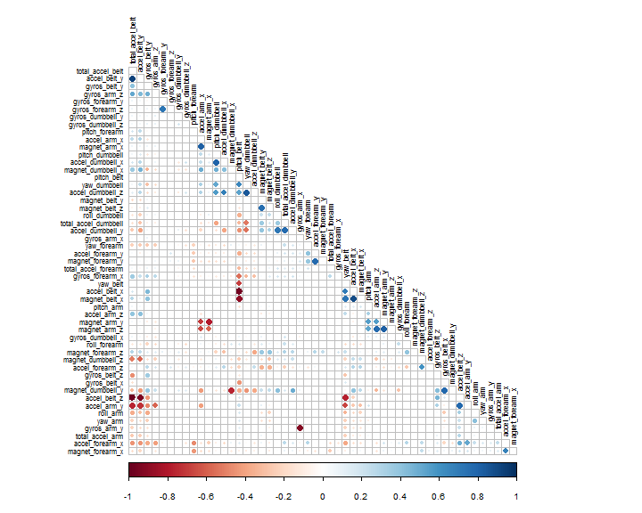
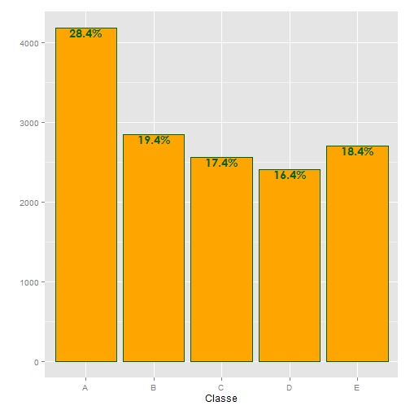

# Practical Machine learning assignment

Azam Yahya Fatehpuri


Loading the required libraries

```r
library(caret, quietly = TRUE, warn.conflicts  = FALSE )
library(doParallel, quietly = TRUE, warn.conflicts  = FALSE)
```

Loading data and dividing into training and testing data set with 75% and 25% observations respectively. 


```r
training <- read.csv("Z:/Ferguson 13 march/other assignment/DS/Coursera/Courses/Machine learning/Assignment/data/pml-training.csv", na.strings = c("", NA))
inTrain = createDataPartition(training$classe, p = 3/4)[[1]]
training = training[ inTrain,]
testing = training[-inTrain,]
```

##Preprocessing
The preprocessing involves handling of missing values, normalization and pricinpal component analysis.

The fisrt step in the preprocess is to remove columns without oberservation. i.e. remove empty columns. 

```r
train2 <- training[ , colSums(is.na(training)) == 0]
```
The above command removes the empty columns from the training data set. In the training data set there are 100 columns for which there are no observations. We are left with 60 columns, out of which 59 of them a


The next step is to check predictors that have zero or near zero variance

```r
nsv <- nearZeroVar(train2, saveMetrics = TRUE)
table(nsv[,4])
```

```
## 
## FALSE  TRUE 
##    59     1
```
So there is only features that is "new_window" that is near zero variance. Therefore we will remove this feature along with other redundant features from our training and testing dataset.


Next step is to remove columns features which has more than 80% correlation. we will use use the "cor" function and corplot plot from the corrplot package to visualize the correlation.

```r
m <- cor(train2[,9:59])
m[upper.tri(m)] <- 0
diag(m) <- 0
library(corrplot,  quietly = TRUE,  warn.conflicts  = FALSE)
corrplot(m, method = "circle", type = "lower", order = "hclust", tl.cex = .7,
         tl.col = "black")
```

 

```r
train3 <- train2[,!apply(m,2,function(x) any(x > 0.8))]
```
 As we can see from the plot features such as yawdumbell with accelbeltx,    and accel_belt with total accelbelt have the highest positive correlation shown by the dark red circles. Similarly, the negative correlation is shown by the blue circles. The higher the size and color intensity, the higher is the correlation between the variables


The next preprocessing includes the normalization of the continous predictors. Therefore in dataset train3, the predictors 6 to 49 are continous which are normalizaed.

```r
preProcValues <- preProcess(train3[c(6:49)], method = c("center", "scale"))
trainTransformed <- predict(preProcValues, train3[c(6:49)])
trainTransformed <- data.frame(trainTransformed, train3[,2],training[,160])
colnames(trainTransformed)[45] <- "user_name"
colnames(trainTransformed)[46] <- "classe"
```

So after that, we have to use the predict function to create normailzed data set for testing data set.

```r
tf <- which(names(testing) %in% names(trainTransformed))
test2  <- testing[,tf]
test2 <- predict(preProcValues, test2)
```

To do the basic exploratory analysis of our outcome variable "classe", we can do make a barchart to analyze the distribution. 

```r
library(scales,  quietly = TRUE, warn.conflicts  = FALSE)
perbar=function(xx){
  q=ggplot(data=data.frame(xx),aes(x=xx))+
    geom_bar(aes(y = (..count..)),fill="orange", colour = "darkgreen")
  q=q+    geom_text(aes(y = (..count..),label = scales::percent((..count..)/sum(..count..))),
                    stat="bin",colour="darkgreen",hjust=.5, vjust=1,
                    fontface=15) 
  q+labs(x = "Classe")+labs(y = "")
}
perbar(trainTransformed$classe)
```

 
As we can see the from the graph, the highest of number classe are categorized as "A" with 28.4 percent. The other four classes almost have a similar classe from range between 16.4% and 19.4%


now because we have 43 predictors, we need a technique to reduce the dimensionality that will result in reduction in computation time and will remove noise.  For this reason we have applied the principal component analysis to our trainTransformed dataset. 

```r
preProc <- preProcess(trainTransformed[,-46], method = "pca", thresh = 0.9)
trainN <- predict(preProc, trainTransformed[,-46])
testN <- predict(preProc, test2)
```
Therefore applying pca function from caret to capture 90% variance, resulted in 18 principal components. 

The next step is to use the predict function to create pricipal components for test data set. This resulted in a new test set namely "testN"

Finally we ready to run our model usign gradient boosting. which produces a prediction model in the form of an ensemble of weak prediction models, typically decision trees. It builds the model in a stage-wise fashion like other boosting methods do, and it generalizes them by allowing optimization of an arbitrary differentiable loss function.

```r
modelFit <- train(trainTransformed$classe~., method = "gbm", data = trainN, verbose = FALSE)
```

Finally to test the accuracy of our model, we have to test the prediction on the test data set set called "testN".


```r
Pred <- predict(modelFit, testN)
TabPred<-table(testN$classe,Pred)
confusionMatrix(TabPred)
```

```
## Confusion Matrix and Statistics
## 
##    Pred
##       A   B   C   D   E
##   A 961  19  22  33  11
##   B  65 573  50  10  18
##   C  38  37 538  15  12
##   D  23  11  61 497   7
##   E  10  49  42  22 540
## 
## Overall Statistics
##                                         
##                Accuracy : 0.8485        
##                  95% CI : (0.8365, 0.86)
##     No Information Rate : 0.2994        
##     P-Value [Acc > NIR] : < 2.2e-16     
##                                         
##                   Kappa : 0.808         
##  Mcnemar's Test P-Value : < 2.2e-16     
## 
## Statistics by Class:
## 
##                      Class: A Class: B Class: C Class: D Class: E
## Sensitivity            0.8760   0.8316   0.7546   0.8614   0.9184
## Specificity            0.9669   0.9519   0.9654   0.9670   0.9600
## Pos Pred Value         0.9187   0.8003   0.8406   0.8297   0.8145
## Neg Pred Value         0.9481   0.9607   0.9421   0.9739   0.9840
## Prevalence             0.2994   0.1880   0.1946   0.1575   0.1605
## Detection Rate         0.2623   0.1564   0.1468   0.1356   0.1474
## Detection Prevalence   0.2855   0.1954   0.1747   0.1635   0.1809
## Balanced Accuracy      0.9215   0.8918   0.8600   0.9142   0.9392
```

Therefore, the confusion matrix shows the accuracy measures for the model. The accuracy is 59.21%, whcih mean 59.21 of the times we have predicted the outcome accurately. The other measure of accuracy is Kappa, which in this case is .48.
